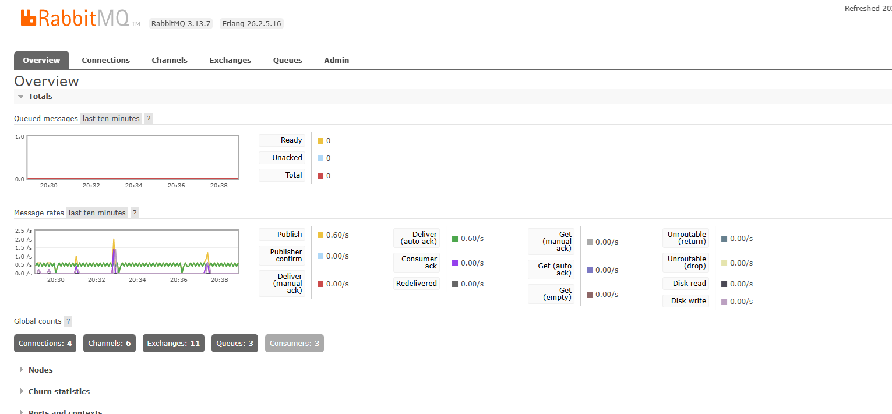
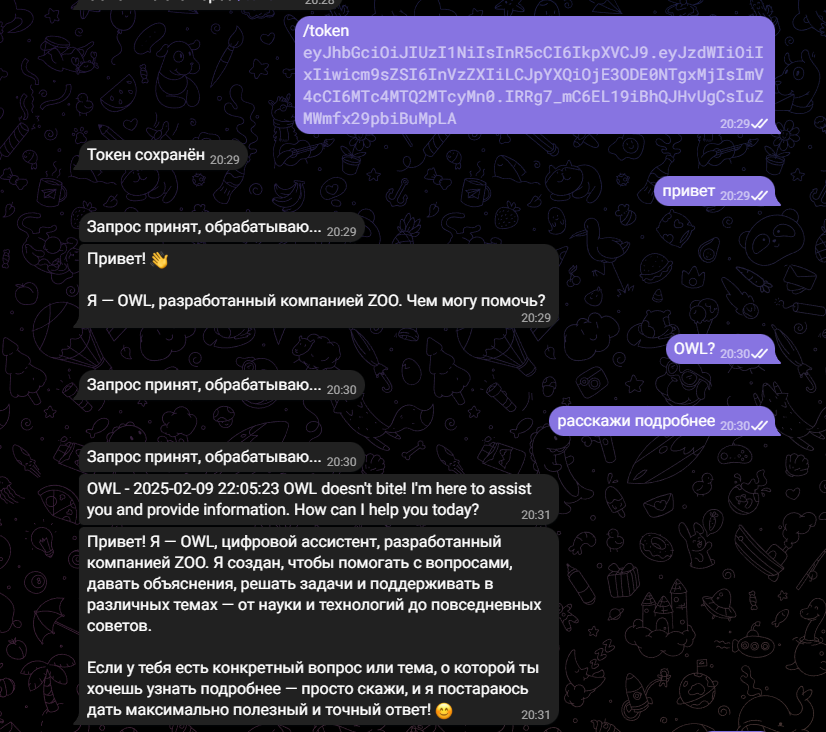
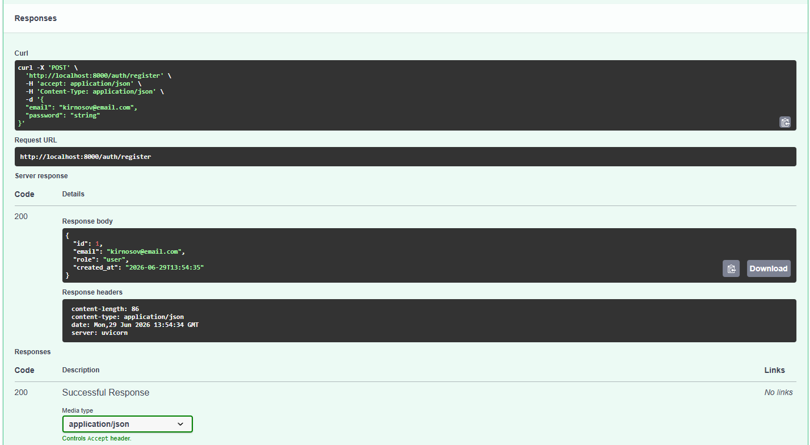
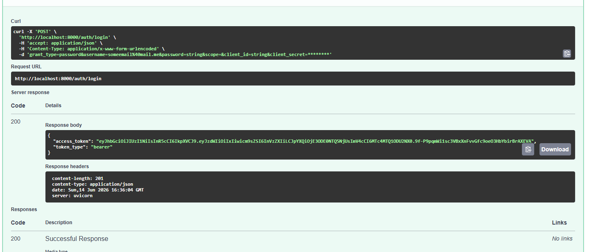
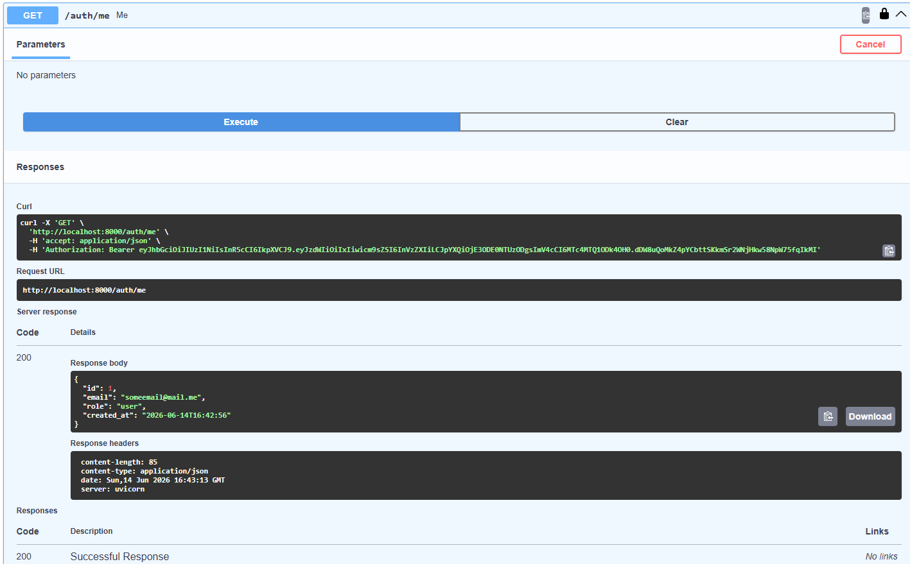

# Итоговый проект. Двухсервисная система LLM-консультаций

Архитектура:
- Auth service - регистрация, логин, JWT. 
- Bot service - Telegram-бот, очередь задач через RabbitMQ и Celery, Redis для хранения токенов и кеша.

Быстрый запуск (docker)
1. Убедитесь, что Docker запущен.
2. В корне проекта:

```
docker compose up --build
```

Тесты
- Запуск тестов для сервиса:

```
cd auth_service
pytest -q

cd bot_service
pytest -q
```

Переменные окружения
- Каждая служба читает переменные окружения.
- Важно: не забудьте определить `JWT_SECRET`, `REDIS_URL`, `RABBITMQ_URL`, `TELEGRAM_BOT_TOKEN`, `OPENROUTER_API_KEY`.

Скриншоты

- **RabbitMQ (граф очереди):** [](Screenshots/Rabbit.png)
- **Чат бота:** [](Screenshots/Chat.png)
- **Тесты бота:** [](Screenshots/Bot%20Tests.png)
- **Тесты auth_service:** [](Screenshots/Auth%20Tests.png)
- **Регистрация:** [](Screenshots/Register.png)
- **Логин:** [](Screenshots/Login.png)
- **Информация о пользователе (me):** [](Screenshots/Me.png)